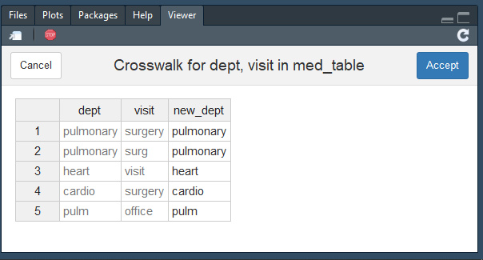
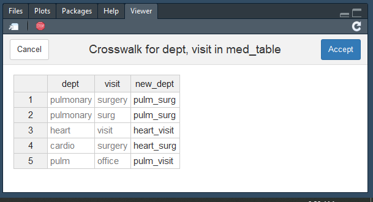
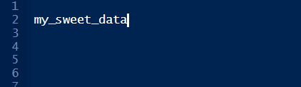

<!-- README.md is generated from README.Rmd. Please edit that file -->

```{r, include = FALSE}
#
knitr::opts_chunk$set(
  collapse = TRUE,
  comment = "#>",
  fig.path = "man/figures/README-",
  #out.width = "100%",
  fig.pos = 'c'
  #fig.align = "center"
)
```

```{r setup, include=FALSE}
.libPaths("C:/Users/HALVORS/Documents/rlibs")
library('lubridate')
library('tidyverse')
library('kableExtra')
library('SvenR')
```


I like to pretend I'm a software developer so I created this little package. It's not a super fancy or cohesive group of functions but I do use these (mostly interactively) in the course of my work. In any case creating a library is fun so maybe you will enjoy it too. I'll show some examples of what the code can do and what the ideas behind it are.

### Installation

Get it from [github](https://www.github.com/svenhalvorson/svenr):

```{r example, message = FALSE, eval = FALSE, echo = TRUE}
devtools::install_github('svenhalvorson/svenr')
library('SvenR')
```

Some of the functions I've tested quite a bit and others less so. If you find any horrendous errors, please let me know at svenpubmail@gmail.com

### Formatting numbers

If I ever get the infamous interview question 'what is your biggest weakness?' I have an answer prepped: low tolerance for tedium. The idea of manually punching in lots of numbers to report is not only unappealing, it opens the door to unreproducible research. As a result, I created a function to round confidence intervals and one to make nice IQRs. I also have one for rounding cohort tables (produced by the `tableone` package) that I might clean up and post later.

The first function, `format_ci` tries to make your confidence intervals cleaner and easier to read. It takes in three vectors (point estimate, upper/lower bounds) and starts and iterative rounding process. Here we'll show an example with the `nycflights` dataset and `broom`

```{r ci_data, fig.align = 'center'}

# Make a binary variable of if the plane left on time:
flights2 = nycflights13::flights %>% 
  mutate(
    on_time = as.numeric(dep_delay <= 0)
  )

# now make a logistic model of this with a few factors
on_time_model = glm(
  on_time ~ dep_time + origin + distance,
  family = binomial, 
  data = flights2
)

# And here's the table of unformatted confidence intervals:
on_time_est = on_time_model %>% 
  broom::tidy(
    conf.int = TRUE,
    exponentiate = TRUE
  ) %>% 
  select(
    term,
    estimate,
    conf.low,
    conf.high
  )
```

```{r ci_data_disp, echo = FALSE, fig.align = 'center'}

on_time_est %>%
  kable(
    align = 'c',
    format = 'markdown'
  )

```

There are a number of problems you can come across when trying to round the confidence intervals. One of which is that you are likely to use a null value, such as 1 in the case of an odds ratio, but you don't want any of these numbers to be rounded to that. Another concern is that you would like to have three distinct numbers displayed so that we can properly see the width of the interval and whether it contains the null value. This function can be set with a null value and other unacceptable values which will not be allowed as endpoints of the CI:

```{r ci_create, fig.align = 'center'}

on_time_est_fmt = with(
  on_time_est,
  format_ci(
    point = estimate,
    lower = conf.low,
    upper = conf.high,
    null_value = 1
  )
)
```

```{r ci_display, echo = FALSE, fig.align = 'center'}
on_time_est_fmt %>% 
  kable(
    align = 'c',
    format = 'markdown'
  )
```

You can tell it how many digits to round to but it will guess if not supplied. It has a maximum number of iterations (which can be specified) to try before giving up so keep that in mind.

Another formatting function I wrote is `pretty_iqr` which makes a nice version of a median [Q1, Q3] for a vector:

```{r pretty_iqr, fig.align = 'center'}

pretty_iqr(
  x = flights2$dep_delay,
  digits = 1
)

```


### Time Weighted Averages

Time weighted averages are a way of summarizing a numerical variable over many time points. It's often useful when the measurements occur at irregular intervals. Basically we're multiplying the values by how long they occur for and then dividing by the total time. It's very similar to taking a Riemann sum.

Here's some example data:

```{r twa_data, echo = FALSE, fig.align = 'center'}

start_date = ymd_hms('2019-01-01 00:00:00')
twa_ex = tibble(
  id = c(1, 1, 1, 1, 2, 2),
  val = c(4, 6, 8, 6, 1, NA),
  t = minutes(c(0, 10, 15, 45, 0, 10)) + start_date
)
kable(
  twa_ex, 
  align = 'c', 
  format = 'markdown'
)

```

The idea here is that have an `id` variable, a `val`ue variable, and a `t`ime variable. We want to summarize the value over time. There are three methods of counting the points that are supported: trapezoids and left/right endpoints.

Visually, id #1's values look like this:

```{r twa_types, echo = FALSE, fig.align='center', fig.align='center', fig.width=7, fig.height=3.5}

id1 = twa_ex %>% 
  filter(id == 1)
id1 = id1 %>% 
  bind_rows(id1) %>% 
  bind_rows(id1) %>% 
  mutate(
    group = case_when(
      (row_number()-1) %/% 4 == 0 ~ 'Trapezoid',
      (row_number()-1) %/% 4 == 1 ~ 'Left',
      (row_number()-1) %/% 4 == 2 ~ 'Right')
  )

sticks = tribble(~t, ~val, ~group,
                 id1$t[1], 0, 'Trapezoid',
                 id1$t[1], 4, 'Trapezoid',
                 id1$t[2], 6, 'Trapezoid',
                 id1$t[3], 8, 'Trapezoid',
                 id1$t[4], 6, 'Trapezoid',
                 id1$t[4], 0, 'Trapezoid',
                 id1$t[1], 0, 'Left',
                 id1$t[1], 4, 'Left',
                 id1$t[2], 4, 'Left',
                 id1$t[2], 6, 'Left',
                 id1$t[3], 6, 'Left',
                 id1$t[3], 8, 'Left',
                 id1$t[4], 8, 'Left',
                 id1$t[4], 0, 'Left',
                 id1$t[1], 0, 'Right',
                 id1$t[1], 6, 'Right',
                 id1$t[2], 6, 'Right',
                 id1$t[2], 8, 'Right',
                 id1$t[3], 8, 'Right',
                 id1$t[3], 6, 'Right',
                 id1$t[4], 6, 'Right',
                 id1$t[4], 0, 'Right')

ggplot() +
  geom_polygon(data = sticks, mapping = aes(x = t, y = val), fill = 'goldenrod1') +
  geom_point(data = id1, mapping = aes(x = t, y = val), size = 2) +
  #theme_minimal() +
  scale_y_continuous(limits = c(0, 10), breaks = 0:5*2) + 
  facet_grid(.~group) +
  theme(axis.text.x = element_text(angle = 90))

```

The time weighted average is the area in yellow divided by the total time (45 min). The methods will produce similar results if the number of data points is large but they can be different in a small data set like this.

The time weighted average using left endpoints is this:

\[\frac{4\cdot10+6\cdot5+8\cdot30}{45}=6.89\]

Using the function:

```{r twa_execute}

twa(
  df = twa_ex, 
  value_var = val, 
  time_var = t, 
  id, 
  method = 'left'
)

```

You must supply the data frame to use, identify the time and value variables, list any id variables, and the method. The function computes the time weighted average across each combination of the ids, it tells you the total time used, the largest/smallest intervals (gap), the number of measures received, the number utilized, and the number missing.

Some notes:

* Records with missing values or times are removed
* If multiple records occur at the same time, the median is used
* If only one record is given for a particular combination of ids, it is returned
* Nonstandard evaluation is used column names within the data frame
* You can supply a numeric, non-`POSIXct` time vector

I also allowed for computing this summary statistic relative to a reference value.
The four `ref_dir` modes are as follows:

* `raw`: no alterations to the data
* `above` x: The distance above x is counted instead of the raw values. Values below x are counted as zeroes.
* `below` x: The converse of `above`.
* `about` x: The absolute distance from x is used.

Here's an example of computing the time weighted average above 5:
```{r twa_execute2}

twa(
  df = twa_ex, 
  value_var = val, 
  time_var = t, 
  id, 
  ref = 5, 
  ref_dir = 'above', 
  method = 'left'
)

```

```{r twa_above, echo = FALSE, fig.align='center', fig.align='center', fig.width=4, fig.height=3.5}


sticks2 = tribble(~t, ~val,
                 id1$t[2], 5,
                 id1$t[2], 6,
                 id1$t[3], 6,
                 id1$t[3], 8,
                 id1$t[4], 8,
                 id1$t[4], 5)
ggplot() +
  geom_polygon(data = sticks2, mapping = aes(x = t, y = val), fill = 'goldenrod1') +
  geom_point(data = id1, mapping = aes(x = t, y = val), size = 2) +
  scale_y_continuous(limits = c(0, 10), breaks = 0:5*2) + 
  theme(axis.text.x = element_text(angle = 90)) +
  geom_hline(yintercept = 5, linetype = 'dashed')

```

This can be useful if you have a benchmark value you're trying to compare to. Note that it uses the entire 45 minutes as the denominator even though the first reading was set to zero because it is less than 5.

### Checking IDs

I often get data where I'm not sure if a set of variables uniquely identify observations, whether any set does, or if the count of specific variables has changed. I created a few functions that help with these types of problems. They are mostly for interactive use.

The first is simply a count of unique values for some supplied variables:

```{r count_ids_ex}

count_ids(
  mtcars,
  cyl, 
  carb
)

```
We have 32 observations, 3 unique values for `cyl`, and 6 for `carb`. It's pipe-able so you can see what changes a function will cause:

```{r count_ids_ex2}

mtcars %>% 
  count_ids(cyl, carb) %>% 
  dplyr::filter(cyl > 4) %>% 
  count_ids(cyl, carb)

```

I often use this to make sure my merges are doing what I expect. The next function can either check if a combination of columns uniquely specify the observations or try and find such a combination. Do `cyl` and `mpg` uniquely specify the cars in `mtcars`?

```{r check_id_ex}

check_id(mtcars, cyl, mpg)

```

You can also use it to try and search for a unique combination of variables by only supplying the data frame:
```{r check_id_ex2}

check_id(mtcars)

```

The function starts searching by single columns, then tries pairs of columns, up to the number of columns equal to the value supplied to `max_depth` before giving up. In this case, any of those 9 pairs of variables uniquely specify the observations. If no unique keys are found, the closest combination(s) are listed:

```{r check_id_ex3}

check_id(mtcars, max_depth = 1)

```

Lastly, here's a variation on `duplicated` called `dupes` that I find much more useful for investigating. It flags every observation with at least one other duplicate:

```{r dupes}

mtcars %>% 
  dplyr::mutate(drat_dupe = dupes(drat)) %>% 
  dplyr::arrange(drat) %>% 
  dplyr::select(drat, drat_dupe)

```

Most of the time when investigating observations with duplicated keys, I want to see the other values that are not duplicated to try and differentiate the observations. This was inspired by the STATA function 'duplicates tag' that makes it easier to look at observations with the same IDs.

### Missing data

I have a couple of functions that I wrote to help identify missing data. First off, I just kept writing `sum(is.na(x))` so here it is:

```{r sum_na}

sum_na(x = c(NA, NA, 3, 4, NA, NA))

```

I also wrote a summary function, `col_miss`, for a data set. It computes the percent of observations that are missing for each column:

```{r col_miss1}

dat1 = tibble::tibble(
  x = c(NA, NA, 3, 4, NA, NA),
  y = c(NA, 'a', 'b', 'c', '', '')
)

col_miss(dat1)
```

You can tell it to consider empty strings as missing:

```{r col_miss2}
col_miss(dat1, empty_string = TRUE)

```

I'm not sure about you but at my old job I always received excel sheets with vertically merged cells. When you load these up, they have a bunch of blank entries that should be repititions. Here's a function that can deal with that:

```{r fill_down}

NM = c(NA, 'Ruidoso', NA, '', NA, 'Corona', NA, 'Roswell')
fill_down(NM)
fill_down(NM, empty_string = TRUE)
fill_down(NM, reverse = TRUE)
```

I later found out that the function `tidyr::fill` does almost the same thing. `fill_down` does two things differently though:

* It can treat blank strings as missing
* It can operate on vectors outside of data frames

For these reasons I've kept it around but it's not necessary most of the time.

### Creating Crosswalks

Frequently I encounter text data that I want to bin. This often comes about when I have hand written records or data with very slight variations on a theme. Sometimes it's easy enough to do this with regular expressions but I often find these unreliable if the underlying data changes. Sometimes it's nicer to just make a crosswalk manually so I created a shiny gadget to do exactly this. 

Here's an example data set of hospital visits to different departments:

```{r cross_table}
med_table = tibble::tibble(dept = c('pulmonary',
                            'pulmonary',
                            'heart',
                            'cardio',
                            'cardio',
                            'pulm'),
                   visit = c('surgery',
                             'surg',
                             'visit',
                             'surgery',
                             'surgery',
                             'office'))
med_table
```

To use this tool, call the `crosswalk` function on a data frame and supply the columns you wish to cross from:

```{r cross_example, message = FALSE, eval = FALSE, echo = TRUE}

crosswalk(med_table, dept, visit)

```

This will create a table in your Rstudio viewer:



The last column will always be whatever the first one you enter prefixed with 'new_'. The last column is editable:



Then when you hit accept, it will generate the code that creates your crosswalk:

```{r cross_done}

med_table_cross = structure(list(dept = c("pulmonary", "pulmonary", "heart", "cardio", "pulm"), visit = c("surgery", "surg", "visit", "surgery", "office"), new_dept = c("pulm_surg", "pulm_surg", "heart_visit", "heart_surg", "pulm_visit")), row.names = c(NA, -5L), class = "data.frame")

med_table_cross

```

Then you'll usually join it onto the original:

```{r cross_done2}
med_table %>% 
  dplyr::left_join(med_table_cross)

```

I created this using the `rstudioapi` so it actually replaces the `crosswalk` command in the rstudio source editor with the result. The reason for this is that this way the `data.frame` can just be implanted into a script and other users will not need SvenR or the clicking and typing that created the crosswalk.

I did create some safegaurds to try and prevent people (mostly me) from deleting their own code so it will not execute if you have multiple lines highlighted when you run `crosswalk` or the text of that line does not contain `crosswalk(.+)`.

A few more notes:

* Notice that `med_table` had 6 observations but the cross has 5. This is because `crosswalk` only takes distinct combinations of the variables supplied.  
* If you want to get cominations of variables not present in the data set, you can set `all_combos = TRUE` to use `expand` instead of `distinct`

### A lovely hotkey

This last piece might not seem so amazing but it's actually one of the most useful things I've done in this library. It's just a little add-in, called `pipe_next`, that takes whatever is left your cursor on that line and sets it equal to itself, then a pipe, and then puts the cursor to the next line indented. I set this to a hotkey and use it nonstop:




