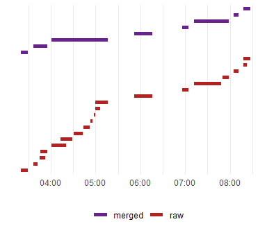

SvenR
================

- [Installation](#installation)
- [Formatting numbers](#formatting-numbers)
- [Time weighted averages](#time-weighted-averages)
- [Merging time intervals](#merging-time-intervals)
- [Checking IDs](#checking-ids)
- [Missing data](#missing-data)
- [Creating crosswalks](#creating-crosswalks)
- [A lovely hotkey](#a-lovely-hotkey)

<!-- README.md is generated from README.Rmd. Please edit that file -->

*UPDATE 2023-06-29: I haven’t seriously used this package in a few years
and my skills have improved dramatically since. There’s some good stuff
in here but it probably needs to be overhauled if it’s to be of use to
anyone else. I’m not sure whether I’ll refactor/trim this down or just
leave it as a relic of the past.*

I like to pretend I’m a software developer so I created this little
package. It’s not a super fancy or cohesive group of functions but I do
use these (mostly interactively) in the course of my work. In any case
creating a library is fun so maybe you will enjoy it too. I’ll show some
examples of what the code can do and what the ideas behind it are.

### Installation

Get it from [github](https://www.github.com/svenhalvorson/svenr):

``` r
devtools::install_github('svenhalvorson/svenr')
library('SvenR')
```

Some of the functions I’ve tested quite a bit and others less so. If you
find any horrendous errors, please let me know at
<svenpubmail@gmail.com>

### Formatting numbers

If I ever get the infamous interview question ‘what is your biggest
weakness?’ I have an answer prepped: low tolerance for tedium. The idea
of manually punching in lots of numbers to report is not only
unappealing, it opens the door to unreproducible research. As a result,
I created a function to round confidence intervals and one to make nice
IQRs. I also have one for rounding cohort tables (produced by the
`tableone` package) that I might clean up and post later.

The first function, `format_ci` tries to make your confidence intervals
cleaner and easier to read. It takes in three vectors (point estimate,
upper/lower bounds) and starts and iterative rounding process. Here
we’ll show an example with the `nycflights` dataset and `broom`

``` r

# Make a binary variable of if the plane left on time:
flights2 = nycflights13::flights %>% 
  mutate(
    on_time = as.numeric(dep_delay <= 0)
  )

# now make a logistic model of this with a few factors
on_time_model = glm(
  on_time ~ dep_time + origin + distance,
  family = binomial, 
  data = flights2
)

# And here's the table of unformatted confidence intervals:
on_time_est = on_time_model %>% 
  broom::tidy(
    conf.int = TRUE,
    exponentiate = TRUE
  ) %>% 
  select(
    term,
    estimate,
    conf.low,
    conf.high
  )
```

|    term     | estimate  | conf.low  | conf.high |
|:-----------:|:---------:|:---------:|:---------:|
| (Intercept) | 7.6331444 | 7.4263549 | 7.8460189 |
|  dep_time   | 0.9987326 | 0.9987168 | 0.9987484 |
|  originJFK  | 1.4831072 | 1.4570339 | 1.5096590 |
|  originLGA  | 1.5935080 | 1.5645311 | 1.6230351 |
|  distance   | 0.9998968 | 0.9998866 | 0.9999071 |

There are a number of problems you can come across when trying to round
the confidence intervals. One of which is that you are likely to use a
null value, such as 1 in the case of an odds ratio, but you don’t want
any of these numbers to be rounded to that. Another concern is that you
would like to have three distinct numbers displayed so that we can
properly see the width of the interval and whether it contains the null
value. This function can be set with a null value and other unacceptable
values which will not be allowed as endpoints of the CI:

``` r

on_time_est_fmt = with(
  on_time_est,
  format_ci(
    point = estimate,
    lower = conf.low,
    upper = conf.high,
    null_value = 1
  )
)
```

|  point  |  lower  |  upper  |             CI             |
|:-------:|:-------:|:-------:|:--------------------------:|
|  7.63   |  7.43   |  7.85   |     7.63 (7.43, 7.85)      |
| 0.99873 | 0.99872 | 0.99875 | 0.99873 (0.99872, 0.99875) |
|  1.48   |  1.46   |  1.51   |     1.48 (1.46, 1.51)      |
|  1.59   |  1.56   |  1.62   |     1.59 (1.56, 1.62)      |
| 0.99990 | 0.99989 | 0.99991 | 0.99990 (0.99989, 0.99991) |

You can tell it how many digits to round to but it will guess if not
supplied. It has a maximum number of iterations (which can be specified)
to try before giving up so keep that in mind.

I added the function `format_p` to deal with p-values in the same
spirit:

``` r

p_vals = c(0.05033, 0.7894, 0.999964, 0.00007)

format_p(
  p = p_vals,
  min_digits = 3,
  max_digits = 4,
  level = 0.05
)
#> [1] "0.050"      "0.789"      "1.000"      "P < 0.0001"
```

Like `format_ci`, I force the rounding not to round to potentially
ambiguous values. The `min_digits` I asked for was three but the first
p-value goes to four digits to be clear about which side of the
significance level it’s on. The argument `max_digits` controls how small
a p-value can be before it is listed as ‘P \< 0.00….1’.

Another formatting function I wrote is `pretty_iqr` which makes a nice
version of a median \[Q1, Q3\] for a vector:

``` r

pretty_iqr(
  x = flights2$dep_delay,
  digits = 1
)
#> [1] "-2.0 [-5.0, 11.0]"
```

### Time weighted averages

Time weighted averages are a way of summarizing a numerical variable
over many time points. It’s often useful when the measurements occur at
irregular intervals. Basically we’re multiplying the values by how long
they occur for and then dividing by the total time. It’s very similar to
taking a Riemann sum.

Here’s some example data:

| id  | val |          t          |
|:---:|:---:|:-------------------:|
|  1  |  4  | 2019-01-01 00:00:00 |
|  1  |  6  | 2019-01-01 00:10:00 |
|  1  |  8  | 2019-01-01 00:15:00 |
|  1  |  6  | 2019-01-01 00:45:00 |
|  2  |  1  | 2019-01-01 00:00:00 |
|  2  | NA  | 2019-01-01 00:10:00 |

The idea here is that have an `id` variable, a `val`ue variable, and a
`t`ime variable. We want to summarize the value over time. There are
three methods of counting the points that are supported: trapezoids and
left/right endpoints.

Visually, id \#1’s values look like this:


The time weighted average is the area in yellow divided by the total
time (45 min). The methods will produce similar results if the number of
data points is large but they can be different in a small data set like
this.

The time weighted average using left endpoints is this:


Using the function:

``` r

twa(
  df = twa_ex, 
  value_var = val, 
  time_var = t, 
  id, 
  method = 'left'
)
#> Warning: There were 2 warnings in `dplyr::summarize()`.
#> The first warning was:
#> ℹ In argument: `max_gap = max(time_diff, na.rm = TRUE)`.
#> ℹ In group 2: `id = 2`.
#> Caused by warning in `max()`:
#> ! no non-missing arguments to max; returning -Inf
#> ℹ Run `dplyr::last_dplyr_warnings()` to see the 1 remaining warning.
#> # A tibble: 2 × 8
#>      id   twa total_time max_gap min_gap n_meas n_used  n_na
#>   <dbl> <dbl>      <dbl>   <dbl>   <dbl>  <int>  <int> <int>
#> 1     1  6.89         45      30       5      4      4     0
#> 2     2  1             0       0       0      2      1     1
```

You must supply the data frame to use, identify the time and value
variables, list any id variables, and the method. The function computes
the time weighted average across each combination of the ids, it tells
you the total time used, the largest/smallest intervals (gap), the
number of measures received, the number utilized, and the number
missing.

Some notes:

- Records with missing values or times are removed
- If multiple records occur at the same time, the median is used
- If only one record is given for a particular combination of ids, it is
  returned
- Nonstandard evaluation is used column names within the data frame
- You can supply a numeric, non-`POSIXct` time vector

I also allowed for computing this summary statistic relative to a
reference value. The four `ref_dir` modes are as follows:

- `raw`: no alterations to the data
- `above` x: The distance above x is counted instead of the raw values.
  Values below x are counted as zeroes.
- `below` x: The converse of `above`.
- `about` x: The absolute distance from x is used.

Here’s an example of computing the time weighted average above 5:

``` r

twa(
  df = twa_ex, 
  value_var = val, 
  time_var = t, 
  id, 
  ref = 5, 
  ref_dir = 'above', 
  method = 'left'
)
#> Warning: There were 2 warnings in `dplyr::summarize()`.
#> The first warning was:
#> ℹ In argument: `max_gap = max(time_diff, na.rm = TRUE)`.
#> ℹ In group 2: `id = 2`.
#> Caused by warning in `max()`:
#> ! no non-missing arguments to max; returning -Inf
#> ℹ Run `dplyr::last_dplyr_warnings()` to see the 1 remaining warning.
#> # A tibble: 2 × 8
#>      id   twa total_time max_gap min_gap n_meas n_used  n_na
#>   <dbl> <dbl>      <dbl>   <dbl>   <dbl>  <int>  <int> <int>
#> 1     1  2.11         45      30       5      4      4     0
#> 2     2  1             0       0       0      2      1     1
```


This can be useful if you have a benchmark value you’re trying to
compare to. Note that it uses the entire 45 minutes as the denominator
even though the first reading was set to zero because it is less than 5.

### Merging time intervals

Another problem I have encountered more than a few times is when records
of events are broken up across multiple observations that capture time
intervals. An example of this is records of a patient’s stay in the ICU.
Every time they move rooms the attending caregiver may enter a new
record of when the patient came in and out. Often this style of
measurement is not recorded very accurately and we may have gaps between
the in/out times, overlaps between records, and records that are purely
within the timespan of another.

For many research questions, these changes don’t matter. We just want to
know when they first entered and finally left. To address this I wrote a
function, `merge_periods`, to join time intervals together. Here is some
data I simulated to demonstrate this:

``` r
data(periods_data)
periods_data
#> # A tibble: 241 × 3
#>       id ts_start            ts_end             
#>    <int> <dttm>              <dttm>             
#>  1     1 2020-11-03 03:20:00 2020-11-03 03:29:00
#>  2     1 2020-11-03 03:37:00 2020-11-03 03:42:00
#>  3     1 2020-11-03 03:45:00 2020-11-03 03:53:00
#>  4     1 2020-11-03 03:46:00 2020-11-03 03:55:00
#>  5     1 2020-11-03 04:01:00 2020-11-03 04:21:00
#>  6     1 2020-11-03 04:13:00 2020-11-03 04:29:00
#>  7     1 2020-11-03 04:31:00 2020-11-03 04:43:00
#>  8     1 2020-11-03 04:44:00 2020-11-03 04:52:00
#>  9     1 2020-11-03 04:53:00 2020-11-03 04:56:00
#> 10     1 2020-11-03 04:58:00 2020-11-03 05:00:00
#> # … with 231 more rows
```

Here we can see that there is a 8 minute gap between the first and
second observations. The third and fourth overlap quite a bit. Here is
how we can call `merge_periods` to clean the data:

``` r

merged_periods = merge_periods(
  df = periods_data,
  start_time = ts_start,
  end_time = ts_end,
  id,
  tolerance = 3,
  units = 'minutes'
)
#> 
#> 
#> Sorting data...
#> 
#> 
#> 
#> Merging periods...
```

The required arguments supplied are the data frame (`df`) and the column
names of the start and end time. After that any number of columns to
group by can be supplied (in this case just `id`). Then there are
optional named arguments such as `tolerance` which will allow gaps of
that number of `units` to be merged together. With this call the first
and second records will not be merged since they are 8 minutes apart but
the second and third will. Here is some of the output:

``` r

merged_periods
#> # A tibble: 123 × 3
#>       id ts_start            ts_end             
#>    <int> <dttm>              <dttm>             
#>  1     1 2020-11-03 03:20:00 2020-11-03 03:29:00
#>  2     1 2020-11-03 03:37:00 2020-11-03 03:55:00
#>  3     1 2020-11-03 04:01:00 2020-11-03 05:16:00
#>  4     1 2020-11-03 05:52:00 2020-11-03 06:16:00
#>  5     1 2020-11-03 06:56:00 2020-11-03 07:04:00
#>  6     1 2020-11-03 07:12:00 2020-11-03 07:58:00
#>  7     1 2020-11-03 08:05:00 2020-11-03 08:11:00
#>  8     1 2020-11-03 08:18:00 2020-11-03 08:27:00
#>  9     2 2020-11-03 06:17:00 2020-11-03 06:47:00
#> 10     2 2020-11-03 07:47:00 2020-11-03 08:47:00
#> # … with 113 more rows
```

In the revised data set, we have fewer rows as several of the records
have been deleted or combined. Here the first row stays the same since
it is more than three minutes from the next but rows 2, 3, and 4 have
all been combined.

Another feature of this is that you can optionally return a nested data
fram that contains the original and merged data along with optional
plots:

``` r

merged_periods2 = merge_periods(
  df = periods_data,
  start_time = ts_start,
  end_time = ts_end,
  id,
  tolerance = 3,
  units = 'minutes',
  simplify = FALSE,
  plots = TRUE
)
```

When `simplify = FALSE` the result is a nested tibble that contains the
original and merged data:

``` r

merged_periods2
#> # A tibble: 10 × 4
#> # Rowwise:  id
#>       id               data result            plot  
#>    <int> <list<tibble[,2]>> <list>            <list>
#>  1     1           [19 × 2] <tibble [8 × 2]>  <gg>  
#>  2     2           [60 × 2] <tibble [30 × 2]> <gg>  
#>  3     3           [40 × 2] <tibble [20 × 2]> <gg>  
#>  4     4           [34 × 2] <tibble [18 × 2]> <gg>  
#>  5     5            [2 × 2] <tibble [2 × 2]>  <gg>  
#>  6     6           [14 × 2] <tibble [6 × 2]>  <gg>  
#>  7     7            [4 × 2] <tibble [2 × 2]>  <gg>  
#>  8     8           [19 × 2] <tibble [8 × 2]>  <gg>  
#>  9     9           [37 × 2] <tibble [20 × 2]> <gg>  
#> 10    10           [12 × 2] <tibble [9 × 2]>  <gg>
```

If `plots = TRUE` then we have another column of ggplots showing how the
intervals were combined:

``` r

merged_periods2$plot[[1]]
```



This can be used to check whether or not the function is working
correctly, look for patterns in the periods across cases, and pick a
suitable tolerance for merging.

### Checking IDs

I often use this to make sure my merges are doing what I expect. The
next function can either check if a combination of columns uniquely
specify the observations or try and find such a combination. Do `cyl`
and `mpg` uniquely specify the cars in `mtcars`?

``` r

check_id(mtcars, cyl, mpg)
#> 
#> Key: cyl * mpg 
#>  Not unique within mtcars
#>  68.8% of rows are unique 
#>  10 non-unique rows
```

You can also use it to try and search for a unique combination of
variables by only supplying the data frame:

``` r

check_id(mtcars)
#> Unique key(s) within mtcars:
#>  mpg * wt
#>  mpg * qsec
#>  cyl * qsec
#>  disp * qsec
#>  hp * qsec
#>  drat * qsec
#>  wt * qsec
#>  qsec * am
#>  qsec * carb
```

The function starts searching by single columns, then tries pairs of
columns, up to the number of columns equal to the value supplied to
`max_depth` before giving up. In this case, any of those 9 pairs of
variables uniquely specify the observations. If no unique keys are
found, the closest combination(s) are listed:

``` r

check_id(mtcars, max_depth = 1)
#> 
#> No unique keys found.
#> Closest key(s):          mpg
#> 
#> With any of these keys...
#> Total rows:      32
#> # non-unique rows:   14
#> Percent unique rows: 56.2%
```

Lastly, here’s a variation on `duplicated` called `dupes` that I find
much more useful for investigating. It flags every observation with at
least one other duplicate:

``` r

mtcars %>% 
  dplyr::mutate(drat_dupe = dupes(drat)) %>% 
  dplyr::arrange(drat) %>% 
  dplyr::select(drat, drat_dupe)
#>                     drat drat_dupe
#> Valiant             2.76      TRUE
#> Dodge Challenger    2.76      TRUE
#> Cadillac Fleetwood  2.93     FALSE
#> Lincoln Continental 3.00     FALSE
#> Merc 450SE          3.07      TRUE
#> Merc 450SL          3.07      TRUE
#> Merc 450SLC         3.07      TRUE
#> Hornet 4 Drive      3.08      TRUE
#> Pontiac Firebird    3.08      TRUE
#> Hornet Sportabout   3.15      TRUE
#> AMC Javelin         3.15      TRUE
#> Duster 360          3.21     FALSE
#> Chrysler Imperial   3.23     FALSE
#> Maserati Bora       3.54     FALSE
#> Ferrari Dino        3.62     FALSE
#> Merc 240D           3.69     FALSE
#> Toyota Corona       3.70     FALSE
#> Camaro Z28          3.73     FALSE
#> Lotus Europa        3.77     FALSE
#> Datsun 710          3.85     FALSE
#> Mazda RX4           3.90      TRUE
#> Mazda RX4 Wag       3.90      TRUE
#> Merc 230            3.92      TRUE
#> Merc 280            3.92      TRUE
#> Merc 280C           3.92      TRUE
#> Fiat 128            4.08      TRUE
#> Fiat X1-9           4.08      TRUE
#> Volvo 142E          4.11     FALSE
#> Toyota Corolla      4.22      TRUE
#> Ford Pantera L      4.22      TRUE
#> Porsche 914-2       4.43     FALSE
#> Honda Civic         4.93     FALSE
```

Most of the time when investigating observations with duplicated keys, I
want to see the other values that are not duplicated to try and
differentiate the observations. This was inspired by the STATA function
‘duplicates tag’ that makes it easier to look at observations with the
same IDs.

### Missing data

I have a couple of functions that I wrote to help identify missing data.
First off, I just kept writing `sum(is.na(x))` so here it is:

``` r

sum_na(x = c(NA, NA, 3, 4, NA, NA))
#> [1] 4
```

I also wrote a summary function, `col_miss`, for a data set. It computes
the percent of observations that are missing for each column:

``` r

dat1 = tibble::tibble(
  x = c(NA, NA, 3, 4, NA, NA),
  y = c(NA, 'a', 'b', 'c', '', '')
)

col_miss(dat1)
#> Percent missing by column for dat1 :
#>       x       y 
#> "66.7%" "16.7%"
```

You can tell it to consider empty strings as missing:

``` r
col_miss(dat1, empty_string = TRUE)
#> Percent missing by column for dat1 :
#>       x       y 
#> "66.7%" "50.0%"
```

I’m not sure about you but at my old job I always received excel sheets
with vertically merged cells. When you load these up, they have a bunch
of blank entries that should be repititions. Here’s a function that can
deal with that:

``` r

NM = c(NA, 'Ruidoso', NA, '', NA, 'Corona', NA, 'Roswell')
fill_down(NM)
#> [1] NA        "Ruidoso" "Ruidoso" ""        ""        "Corona"  "Corona" 
#> [8] "Roswell"
fill_down(NM, empty_string = TRUE)
#> [1] NA        "Ruidoso" "Ruidoso" "Ruidoso" "Ruidoso" "Corona"  "Corona" 
#> [8] "Roswell"
fill_down(NM, reverse = TRUE)
#> [1] "Ruidoso" "Ruidoso" ""        ""        "Corona"  "Corona"  "Roswell"
#> [8] "Roswell"
```

I later found out that the function `tidyr::fill` does almost the same
thing. `fill_down` does two things differently though:

- It can treat blank strings as missing
- It can operate on vectors outside of data frames

For these reasons I’ve kept it around but it’s not necessary most of the
time.

### Creating crosswalks

Frequently I encounter text data that I want to bin. This often comes
about when I have hand written records or data with very slight
variations on a theme. Sometimes it’s easy enough to do this with
regular expressions but I often find these unreliable if the underlying
data changes. Sometimes it’s nicer to just make a crosswalk manually so
I created a shiny gadget to do exactly this.

Here’s an example data set of hospital visits to different departments:

``` r
med_table = tibble::tibble(
  dept = c(
    'pulmonary',
    'pulmonary',
    'heart',
    'cardio',
    'cardio',
    'pulm'),
  visit = c(
    'surgery',
    'surg',
    'visit',
    'surgery',
    'surgery',
    'office'
  )
)
med_table
#> # A tibble: 6 × 2
#>   dept      visit  
#>   <chr>     <chr>  
#> 1 pulmonary surgery
#> 2 pulmonary surg   
#> 3 heart     visit  
#> 4 cardio    surgery
#> 5 cardio    surgery
#> 6 pulm      office
```

To use this tool, call the `crosswalk` function on a data frame and
supply the columns you wish to cross from:

``` r

crosswalk(med_table, dept, visit)
```

This will create a table in your Rstudio viewer:


The last column will always be whatever the first one you enter prefixed
with ‘new\_’. The last column is editable:


Then when you hit accept, it will generate the code that creates your
crosswalk:

``` r

med_table_cross = structure(list(dept = c("pulmonary", "pulmonary", "heart", "cardio", "pulm"), visit = c("surgery", "surg", "visit", "surgery", "office"), new_dept = c("pulm_surg", "pulm_surg", "heart_visit", "heart_surg", "pulm_visit")), row.names = c(NA, -5L), class = "data.frame")

med_table_cross
#>        dept   visit    new_dept
#> 1 pulmonary surgery   pulm_surg
#> 2 pulmonary    surg   pulm_surg
#> 3     heart   visit heart_visit
#> 4    cardio surgery  heart_surg
#> 5      pulm  office  pulm_visit
```

Then you’ll usually join it onto the original:

``` r
med_table %>% 
  dplyr::left_join(med_table_cross)
#> Joining with `by = join_by(dept, visit)`
#> # A tibble: 6 × 3
#>   dept      visit   new_dept   
#>   <chr>     <chr>   <chr>      
#> 1 pulmonary surgery pulm_surg  
#> 2 pulmonary surg    pulm_surg  
#> 3 heart     visit   heart_visit
#> 4 cardio    surgery heart_surg 
#> 5 cardio    surgery heart_surg 
#> 6 pulm      office  pulm_visit
```

I created this using the `rstudioapi` so it actually replaces the
`crosswalk` command in the rstudio source editor with the result. The
reason for this is that this way the `data.frame` can just be implanted
into a script and other users will not need SvenR or the clicking and
typing that created the crosswalk.

I did create some safegaurds to try and prevent people (mostly me) from
deleting their own code so it will not execute if you have multiple
lines highlighted when you run `crosswalk` or the text of that line does
not contain `crosswalk(.+)`.

A few more notes:

- Notice that `med_table` had 6 observations but the cross has 5. This
  is because `crosswalk` only takes distinct combinations of the
  variables supplied.  
- If you want to get cominations of variables not present in the data
  set, you can set `all_combos = TRUE` to use `expand` instead of
  `distinct`

### A lovely hotkey

This last piece might not seem so amazing but it’s actually one of the
most useful things I’ve done in this library. It’s just a little add-in,
called `pipe_next`, that takes whatever is left your cursor on that line
and sets it equal to itself, then a pipe, and then puts the cursor to
the next line indented. I set this to a hotkey and use it nonstop:

<figure>

<figcaption aria-hidden="true">pipe lyfe</figcaption>
</figure>
