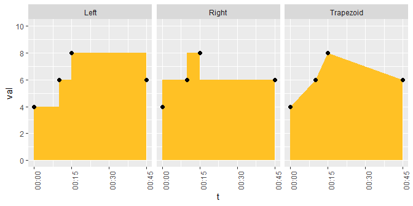
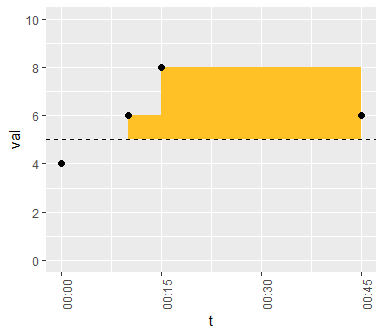

SvenR
================

-   [Installation](#installation)
-   [Time Weighted Averages](#time-weighted-averages)
-   [Checking IDs](#checking-ids)
-   [Missing data](#missing-data)

**IN PROGRESS (2019-06-17) Stuff I'm working on right now:**

-   ~~Working on dependencies. I don't want the package to attach anything when loaded so I have to go through and add dplyr:: to things~~
-   ~~Trying to make a shiny gadget that helps you manually create crosswalks~~
    -   Figure out what convention or protections to use to write code to the source file
-   Adding examples of code usage in this file
-   Decide which functions should use NSE and which should not

<!-- README.md is generated from README.Rmd. Please edit that file -->
I like to pretend I'm a software developer so I created this little package. It's probably completely unnecessary as I frequently find better versions of the functions I write later. Creating a library is fun though, so maybe you will enjoy it too. I'll show some examples of what the code can do and what my ideas were behind it.

### Installation

Get it from [github](https://www.github.com/svenhalvorson/svenr):

``` r
devtools::install_github('svenhalvorson/svenr')
library('SvenR')
```

If you find any horrendous errors, please let me know at <svenpubmail@gmail.com>

### Time Weighted Averages

Time weighted averages are a way of summarizing a numerical variable over many time points. It's often useful when the measurements occur at irregular intervals. Basically we're multiplying the values by how long they occur for and then dividing by the total time. It's very similar to taking a Riemann sum.

Here's some example data:

|  id | val |          t          |
|:---:|:---:|:-------------------:|
|  1  |  4  | 2019-01-01 00:00:00 |
|  1  |  6  | 2019-01-01 00:10:00 |
|  1  |  8  | 2019-01-01 00:15:00 |
|  1  |  6  | 2019-01-01 00:45:00 |
|  2  |  1  | 2019-01-01 00:00:00 |
|  2  |  NA | 2019-01-01 00:10:00 |

The idea here is that have an **id** variable, a **val**ue variable, and a **t**ime variable. We want to summarize the value over time. There are three methods of counting the points that are supported: trapezoids and left/right endpoints.

Visually, the id \#1's values look like this:



The time weighted average is the area in yellow divided by the total time (45 min). The methods will not compute very different totals if the number of data points is large but they can look different in a small data set like this.

The time weighted average using left endpoints is this:

<!-- $$\frac{4\cdot10+6\cdot5+8\cdot30}{45}=6.89$$ -->
Using the function:

``` r

twa(df = twa_ex, value_var = val, time_var = t, id, method = 'left')
#> # A tibble: 2 x 8
#>      id   twa total_time max_gap min_gap n_meas n_used  n_na
#>   <dbl> <dbl>      <dbl>   <dbl>   <dbl>  <int>  <int> <int>
#> 1     1  6.89         45      30       5      4      4     0
#> 2     2  1             0       0       0      2      1     1
```

You must supply the data frame to use, identify the time and value variables, list any id variables, and the method. The function computes the time weighted average across each combination of the ids, it tells you the total time used, the largest/smallest intervals (gap), the number of measures received, the number utilized, and the number missing.

Some notes:

-   Records with missing values or times are removed
-   If multiple records occur at the same time, the median is used
-   If only one record is given for a particular combination of ids, it is returned
-   Nonstandard evaluation is used for all arguments
-   You can supply a numeric, non-`POSIXct` time vector

I also allowed for computing this summary statistic relative to a reference value. The four `ref_dir` modes are as follows:

-   **Raw**: no alterations to the data
-   **Above x**: The distance above x is counted instead of the raw values. Values below x are counted as zeroes.
-   **Below x**: The converse of above.
-   **About x**: The absolute distance from x is used.

Here's an example of computing the time weighted average above 5:

``` r

twa(df = twa_ex, value_var = val, time_var = t, id, ref = 5, ref_dir = 'above', method = 'left')
#> # A tibble: 2 x 8
#>      id   twa total_time max_gap min_gap n_meas n_used  n_na
#>   <dbl> <dbl>      <dbl>   <dbl>   <dbl>  <int>  <int> <int>
#> 1     1  2.11         45      30       5      4      4     0
#> 2     2  1             0       0       0      2      1     1
```



This is sometimes useful if you have a benchmark value you're trying to compare to. Note that it uses the entire 45 minutes as the denominator even though the first reading was set to zero because it is less than 5.

### Checking IDs

I often get data where I'm not sure if a set of variables uniquely identify observations, whether any set does, or if the count of specific variables has changed. I created a few functions that help with these types of problems. They are mostly for interactive use.

The first is simply a count of unique values for some supplied variables:

``` r

count_ids(mtcars, cyl, carb)
#> [1] "32 observations"
#>   cyl carb
#> 1   3    6
```

We have 32 observations, 3 unique values for `cyl`, and 6 for `carb`. It's pipe-able so you can see what changes a function will cause:

``` r

mtcars %>% 
  count_ids(cyl, carb) %>% 
  dplyr::filter(cyl > 4) %>% 
  count_ids(cyl, carb)
#> [1] "32 observations"
#>   cyl carb
#> 1   3    6
#> [1] "21 observations"
#>   cyl carb
#> 1   2    6
```

I often use this to make sure my merges are doing what I expect. The next function can either check if a combination of columns uniquely specify the observations or try and find such a combination. Do `cyl` and `mpg` uniquely specify the cars in `mtcars`?

``` r

check_id(mtcars, cyl, mpg)
#> 
#> Key: cyl * mpg 
#>  Not unique within mtcars
#>  68.8% of rows are unique 
#>  10 non-unique rows
```

It will tell you if the combination you gave determines a specific row. You can also use it to try and search for a unique combination of variables by only supplying the data frame:

``` r

check_id(mtcars)
#> Unique key(s) within mtcars:
#>  mpg * wt
#>  mpg * qsec
#>  cyl * qsec
#>  disp * qsec
#>  hp * qsec
#>  drat * qsec
#>  wt * qsec
#>  qsec * am
#>  qsec * carb
```

The function starts searching by single columns, then tries pairs of columns, up to the number of columns equal to the value supplied to `max_depth` before giving up. In this case, any of those 9 pairs of variables uniquely specify the observations. If no unique keys are found, the closest combination(s) are listed:

``` r

check_id(mtcars, max_depth = 1)
#> 
#> No unique keys found.
#> Closest key(s):          mpg
#> 
#> With any of these keys...
#> Total rows:      32
#> # non-unique rows:   14
#> Percent unique rows: 56.2%
```

Lastly, here's a variation on `duplicated` called `dupes` that I find much more useful for investigating. It flags every observation with at least one other duplicate:

``` r

mtcars %>% 
  dplyr::mutate(drat_dupe = dupes(drat)) %>% 
  dplyr::arrange(drat) %>% 
  dplyr::select(drat, drat_dupe)
#>    drat drat_dupe
#> 1  2.76      TRUE
#> 2  2.76      TRUE
#> 3  2.93     FALSE
#> 4  3.00     FALSE
#> 5  3.07      TRUE
#> 6  3.07      TRUE
#> 7  3.07      TRUE
#> 8  3.08      TRUE
#> 9  3.08      TRUE
#> 10 3.15      TRUE
#> 11 3.15      TRUE
#> 12 3.21     FALSE
#> 13 3.23     FALSE
#> 14 3.54     FALSE
#> 15 3.62     FALSE
#> 16 3.69     FALSE
#> 17 3.70     FALSE
#> 18 3.73     FALSE
#> 19 3.77     FALSE
#> 20 3.85     FALSE
#> 21 3.90      TRUE
#> 22 3.90      TRUE
#> 23 3.92      TRUE
#> 24 3.92      TRUE
#> 25 3.92      TRUE
#> 26 4.08      TRUE
#> 27 4.08      TRUE
#> 28 4.11     FALSE
#> 29 4.22      TRUE
#> 30 4.22      TRUE
#> 31 4.43     FALSE
#> 32 4.93     FALSE
```

Most of the time when investigating observations with duplicated keys, I want to see the other values that are not duplicated to try and differentiate the observations. This was inspired by the STATA function 'duplicates tag' that makes it easier to look at observations with the same IDs.

### Missing data

I have a couple of functions that I wrote to help identify missing data. First off, I just kept writing `sum(is.na(x))` so here it is:

``` r

sum_na(x = c(NA, NA, 3, 4, NA, NA))
#> [1] 4
```

I also wrote a summary function, `col_miss`, for a data set. You can tell it to consider empty strings as missing:

``` r

tibble::tibble(x = c(NA, NA, 3, 4, NA, NA),
       y = c(NA, 'a', 'b', 'c', '', '')) %>% 
  col_miss
#> [1] "66.7%" "16.7%"

tibble::tibble(x = c(NA, NA, 3, 4, NA, NA),
       y = c(NA, 'a', 'b', 'c', '', '')) %>% 
  col_miss(empty_string = TRUE)
#> [1] "66.7%" "50.0%"
```

I'm not sure about you but at my old job I always received excel sheets with vertically merged cells. When you load these up, they have a bunch of blank entries that should be repititions. Here's a function that can deal with that:

``` r

NM = c(NA, 'Ruidosa', NA, '', NA, 'Corona', NA, 'Roswell')
fill_down(NM)
#> [1] NA        "Ruidosa" "Ruidosa" ""        ""        "Corona"  "Corona" 
#> [8] "Roswell"
fill_down(NM, empty_string = TRUE)
#> [1] NA        "Ruidosa" "Ruidosa" "Ruidosa" "Ruidosa" "Corona"  "Corona" 
#> [8] "Roswell"
fill_down(NM, reverse = TRUE)
#> [1] "Ruidosa" "Ruidosa" ""        ""        "Corona"  "Corona"  "Roswell"
#> [8] "Roswell"
```

I later found out that the function `tidyr::fill` does almost the same thing. `fill_down` does two things differently though:

-   It can treat blank strings as missing
-   It can operate on vectors outside of data frames

For these reasons, I've kept it around but it's necessary most of the time.
