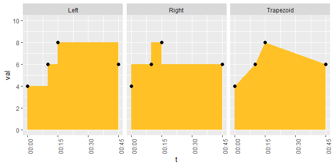

IN PROGRESS (2019-06-05)!
=========================

<!-- README.md is generated from README.Rmd. Please edit that file -->
SvenR
-----

I like to pretend I'm a software developer so I created this little package. It's probably completely unneccessary as I frequently find better versions of the functions I write later. Creating a library is fun though, so maybe you will enjoy it too. I'll show some examples of what the code can do and what my ideas were behind it.

### Installation

Get it from [github](https://www.github.com/svenhalvorson/svenr):

``` r
devtools::install_github('svenhalvorson/svenr')
library('SvenR')
```

### Time Weighted Averages

Time weighted averages are a way of summarizing a numberical variable over many time points. Often it's useful when the measurements occur at irregular intervals. Basically we're multiplying the values by how long they occur for and then dividing by the total time. It's very similar to taking a Riemann sum.

Here's some example data:

|  id | val |          t          |  t2 |
|:---:|:---:|:-------------------:|:---:|
|  1  |  4  | 2019-01-01 00:00:00 |  1  |
|  1  |  6  | 2019-01-01 00:10:00 |  2  |
|  1  |  8  | 2019-01-01 00:15:00 |  3  |
|  1  |  6  | 2019-01-01 00:45:00 |  4  |
|  2  |  1  | 2019-01-01 00:00:00 |  5  |
|  2  |  NA | 2019-01-01 00:10:00 |  6  |

The idea here is that have an **id** variable, a **val**ue variable, and two **t**ime variables. We want to summarize the value over time. There are three methods of counting the points that are supported: trapezoids and left/right endpoints.

Visually, the first id's values look like this:



The time weighted average is the area in yellow divided by the total time (45 min). The methods will not compute very different totals if the number of data points is large but they can look different in a small data set like this.

The time weighted average using left endpoins is this:

<!-- $$\frac{4\cdot10+6\cdot5+8\cdot30}{45}=6.89$$ -->
Using the function:

``` r

twa(df = twa_ex, value_var = val, time_var = t, id, method = 'left')
#> # A tibble: 2 x 8
#>      id   twa total_time max_gap min_gap n_meas n_used  n_na
#>   <dbl> <dbl>      <dbl>   <dbl>   <dbl>  <int>  <int> <int>
#> 1     1  6.89         45      30       5      4      4     0
#> 2     2  1             0       0       0      2      1     1
```

You must supply the data frame to use, identify the time and value variables, list any id variables, and the method. The function computes the time weighted average across each combination of the ids, it tells you the total time used, the largest/smallest intervals (gap), the number of measures received, the number utilized, and the number missing.

Some notes:

-   Records with missing values or times are removed
-   If multiple records occur at the same time, the median is used
-   If only one record is given for a particular combination of ids, it is returned
-   Nonstandard evaluation is used for all arguments
